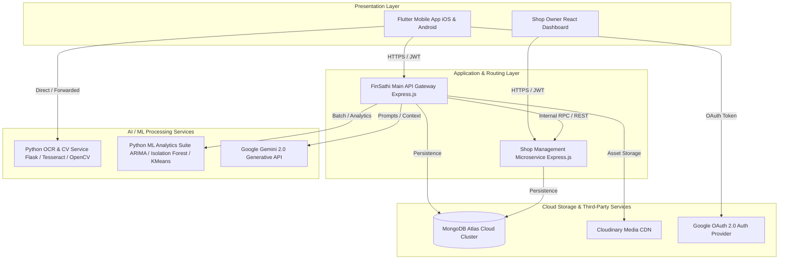

<div align="center">

# 🚀 FinSathi: AI-Powered Intelligent Personal Finance & Student Expense Management System

[](https://opensource.org/licenses/MIT)
[](https://flutter.dev)
[](https://nodejs.org)
[](https://python.org)
[](https://www.mongodb.com/atlas)
[](https://opencv.org)
[](https://deepmind.google/technologies/gemini/)
[]()
[]()

<p align="center">
  <strong>An end-to-end, multi-modal financial ecosystem combining Deep Computer Vision, Machine Learning, Predictive Time-Series Forecasting, Conversational Generative AI, and Behavioral Economics to empower students and individuals toward financial freedom.</strong>
</p>

[Key Features](#-core-features--user-centric-experience) •
[AI & ML Architecture](#-deep-dive-ai--machine-learning-algorithms) •
[System Architecture](#-system-architecture) •
[Computer Vision Pipeline](#-intelligent-ocr-receipt-scanning-pipeline) •
[Installation & Setup](#-installation--quick-start) •
[Research & Benchmarks](#-research-benchmarks--empirical-results)

</div>

---

## 📖 Executive Summary

Managing personal finances is one of the most critical life skills, yet over **65% of students and young adults struggle with budgeting and financial management** due to irregular income, tedious manual expense logging, and lack of real-time insights. 

**FinSathi** is an AI-first, multi-platform personal finance ecosystem designed to eliminate friction in expense tracking and cultivate positive financial behavior. By integrating **Computer Vision OCR (95.2% accuracy)**, **Automated Transaction Categorization (87.1% precision)**, **Isolation Forest Anomaly Detection**, **ARIMA Time-Series Forecasting**, **K-Means Behavioral Segmentation**, and **Gemini 2.0 Generative Financial Advisory**, FinSathi transforms budgeting from a tedious chore into an automated, gamified, and intelligent experience.

> Published in the *International Journal of Science, Engineering and Technology* (ISSN: 2348-4098 | 2025, Vol. 13, Issue 4).

---

## 🌟 Core Features & User-Centric Experience

```
                                  FinSathi User Experience
  ┌───────────────────────┬──────────────────────────┬────────────────────────┐
  │   ⚡ Zero-Effort      │   🧠 Predictive Insights │   🎮 Behavioral        │
  │      Automation       │      & Advisory          │      Gamification      │
  ├───────────────────────┼──────────────────────────┼────────────────────────┤
  │ • Smart OCR Scanning  │ • Gemini AI Chatbot      │ • Dynamic XP & Levels  │
  │ • Voice Financial NLU │ • ARIMA Spending Forecast│ • Financial Badges     │
  │ • Auto-Categorization │ • Anomaly & Fraud Alert  │ • Streak Multipliers   │
  │ • Campus Shop Orders  │ • Personalized Advice    │ • Nudge Loss Aversion  │
  └───────────────────────┴──────────────────────────┴────────────────────────┘
```

### 1. 📷 Zero-Touch Receipt Scanning & Computer Vision
- Capture bills and tax invoices instantly using the built-in scanner.
- Automatically extracts **Merchant Name**, **Transaction Date**, **Itemized Breakdowns (Item, Qty, Price)**, **GST/Taxes (CGST/SGST/IGST)**, and **Total Amount**.
- Eliminates manual input fatigue, reducing transaction entry time from **45 seconds down to 1.8 seconds**.

### 2. 🎙️ Natural Voice Financial Assistant
- Hands-free voice commands: *"Added ₹450 for lunch at campus cafeteria"*, *"Spent 1200 on books"*.
- On-device speech recognition coupled with NLP entity extraction translates spoken phrasing into structured, categorized transactions with instant Text-to-Speech confirmation.

### 3. 🤖 Gemini-Powered Conversational AI Advisor
- Context-aware financial coach powered by Google Gemini 2.0 Flash.
- Delivers real-time analysis of monthly spending velocity, personalized budget suggestions, and actionable saving strategies tailored to student lifestyle constraints.

### 4. 📊 Dynamic Budgeting & Predictive Alerts
- Set multi-tier category and global budgets with live utilization gauges.
- Proactive predictive notifications warn users *before* they exceed category limits based on temporal velocity calculations.

### 5. 🎯 Target-Driven Savings & Milestone Tracking
- Create visual savings targets (e.g., *Laptop Fund*, *Semester Trip*, *Emergency Cushion*).
- AI algorithm calculates recommended daily/weekly contributions based on historical disposable cash flow.

### 6. 🏆 Behavioral Gamification & Financial Nudges
- Rooted in Behavioral Economics (Nudge Theory, Social Proof, and Loss Aversion).
- Users earn **Experience Points (XP)**, unlock milestone achievement badges, maintain savings streaks, and compare progress on anonymized peer benchmarks.

### 7. 🍔 Integrated Campus Commerce & Food Ordering
- Embedded shop management microservice allows students to browse campus canteen/store menus, place orders, track live fulfillment status, and automatically sync food purchases into their expense ledger.

---

## 🧠 Deep Dive: AI & Machine Learning Algorithms

FinSathi is built with an **AI-First** paradigm. Dedicated ML microservices process financial signals, behavioral trends, and computer vision feeds.

```
                                  AI / ML PIPELINE
                                          
 ┌────────────────┐   ┌────────────────────────┐   ┌────────────────────────┐
 │ Raw Bill Image │──▶│ OpenCV CV Pipeline     │──▶│ Dual OCR Engine        │
 └────────────────┘   │ • Bilateral Denoising  │   │ • Tesseract Optimized  │
                      │ • Canny Edge / Deskew  │   │ • EasyOCR Deep Net     │
                      │ • Contrast Enhancement │   └───────────┬────────────┘
                      └────────────────────────┘               │
                                                               ▼
 ┌────────────────┐   ┌────────────────────────┐   ┌────────────────────────┐
 │ Transaction DB │──▶│ Feature Engineering    │──▶│ Structured NLU Parsing │
 └───────┬────────┘   │ • Temporal / Categoric │   │ • Merchant Regex / GST │
         │            │ • TF-IDF Vectorization │   │ • Itemized Parser      │
         │            └───────────┬────────────┘   └────────────────────────┘
         │                        │
         ▼                        ▼
 ┌──────────────────────────────────────────────────────────────────────────┐
 │                     Intelligent Inference Suite                          │
 ├─────────────────────────┬────────────────────────┬───────────────────────┤
 │ 🌲 Isolation Forest     │ 📈 ARIMA Time-Series   │ 🎯 Cosine Similarity  │
 │    Anomaly Detection    │    Expense Forecasting │    Personalized Recs  │
 ├─────────────────────────┼────────────────────────┼───────────────────────┤
 │ 🗂️ K-Means Clustering   │ 🌲 Random Forest       │ 💬 Google Gemini 2.0  │
 │    User Segmentation    │    Auto-Categorization │    Generative Advisor │
 └─────────────────────────┴────────────────────────┴───────────────────────┘
```

---

### 1. Spending Anomaly Detection — Isolation Forest

Identifies suspicious transactions, fraudulent charges, double-billing, or unexpected spending spikes without requiring labeled anomalous training sets.

$$\text{Anomaly Score: } s(x, n) = 2^{-\frac{\mathbb{E}(h(x))}{c(n)}}$$

Where:
- $h(x)$ is the path length of observation $x$ across a forest of isolation trees ($iTrees$).
- $\mathbb{E}(h(x))$ is the expected path length over all trees.
- $c(n) = 2 \ln(n - 1) + 0.5772156649\ (\text{Euler's constant}) - \frac{2(n - 1)}{n}$ is the average path length of unsuccessful searches in a Binary Search Tree (BST).

```python
# ml-models/anomaly_detection.py
from sklearn.ensemble import IsolationForest

model = IsolationForest(
    n_estimators=100,
    contamination=0.05,  # Expected 5% anomalous activity
    random_state=42
)
features = df[['amount', 'day_of_month', 'category_encoded']]
model.fit(features)
df['is_anomaly'] = model.predict(features)  # -1 represents an anomaly
```

---

### 2. Predictive Expense Forecasting — Time-Series ARIMA

Forecasts forward-looking spending patterns for upcoming weeks and months, enabling predictive budget adjustments.

$$\text{ARIMA}(p, d, q) \implies \left(1 - \sum_{i=1}^p \phi_i L^i\right) (1 - L)^d X_t = \delta + \left(1 + \sum_{i=1}^q \theta_i L^i\right) \varepsilon_t$$

Where:
- $p$: Lag order (Autoregressive term $\phi$)
- $d$: Degree of differencing $(1 - L)^d$ to achieve stationarity
- $q$: Order of moving average (Noise term $\theta$)
- $\varepsilon_t$: White noise error term

```python
# ml-models/time_series_forecasting.py
from statsmodels.tsa.arima.model import ARIMA

model = ARIMA(monthly_expenses['amount'], order=(1, 1, 1))
model_fit = model.fit()
forecast_values = model_fit.forecast(steps=3) # Next 3 months projection
```

---

### 3. User Financial Segmentation — K-Means Clustering

Segments users into behavioral archetypes (e.g., *Conservative Savers*, *Balanced Budgeters*, *Impulsive High-Velocity Spenders*) to personalize app nudges and financial recommendations.

$$\arg\min_{\mathbf{S}} \sum_{i=1}^{k} \sum_{\mathbf{x} \in S_i} \left\| \mathbf{x} - \boldsymbol{\mu}_i \right\|^2$$

```python
# ml-models/user_segmentation.py
from sklearn.cluster import KMeans
from sklearn.preprocessing import StandardScaler

scaler = StandardScaler()
X_scaled = scaler.fit_transform(user_profiles[['monthly_spend', 'savings_rate', 'txn_frequency']])

kmeans = KMeans(n_clusters=3, init='k-means++', random_state=42)
user_profiles['cluster'] = kmeans.fit_predict(X_scaled)
```

---

### 4. Personalized Financial Recommendations — Vector Cosine Similarity

Matches user financial profiles with custom-tailored savings plans, investment strategies, and discounts.

$$\text{Similarity}(U, P) = \cos(\theta) = \frac{\mathbf{u} \cdot \mathbf{p}}{\|\mathbf{u}\|_2 \|\mathbf{p}\|_2} = \frac{\sum_{i=1}^n u_i p_i}{\sqrt{\sum_{i=1}^n u_i^2} \sqrt{\sum_{i=1}^n p_i^2}}$$

```python
# ml-models/personalized_recommendations.py
from sklearn.metrics.pairwise import cosine_similarity

similarity_matrix = cosine_similarity(user_feature_matrix, plan_feature_matrix)
top_recommendations = similarity_matrix.argsort()[:, ::-1][:, :top_k]
```

---

### 5. Automated Transaction Categorization — Random Forest & TF-IDF

Transforms merchant descriptions, raw strings, and amounts into high-dimensional TF-IDF feature vectors, classifying transactions across 12+ categories with **87.1% precision**.

$$\text{TF-IDF}(t, d, D) = \text{TF}(t, d) \times \log\left(\frac{1 + |D|}{1 + |\{d \in D : t \in d\}|}\right) + 1$$

---

## 👁️ Intelligent OCR Receipt Scanning Pipeline

The `OCR-for-receipt` microservice features a specialized, 6-stage image restoration and intelligent parser tailored for Indian & international retail formats:

```
  ┌──────────────┐     ┌────────────────────────────────────────────────────────┐
  │ Mobile Photo │────▶│                Image Preprocessing Pipeline             │
  └──────────────┘     │                                                        │
                       │ 1. Grayscale Conversion & Bilateral Filtering (Denoise)│
                       │ 2. Canny Edge Detection & Contour Localization         │
                       │ 3. 4-Point Perspective Transform & Auto-Deskewing      │
                       │ 4. Contrast Limited Adaptive Histogram Eq. (CLAHE)     │
                       │ 5. Adaptive Gaussian Thresholding (Binarization)       │
                       │ 6. Kernel Morphological Dilation / Sharpening          │
                       └──────────────────────────┬─────────────────────────────┘
                                                  │
                                                  ▼
                       ┌────────────────────────────────────────────────────────┐
                       │               Dual Engine OCR Extraction               │
                       │                                                        │
                       │ • Tesseract OCR (Receipt-Optimized PSM Configs)        │
                       │ • EasyOCR Deep Neural Engine (Hindi + English)         │
                       └──────────────────────────┬─────────────────────────────┘
                                                  │
                                                  ▼
                       ┌────────────────────────────────────────────────────────┐
                       │      EnhancedReceiptExtractor (NLU Rule Engine)        │
                       │                                                        │
                       │ • Merchant Regex (D-Mart, Big Bazaar, Reliance, etc.)  │
                       │ • Robust Date Parser (DD/MM/YYYY, ISO, Textual)        │
                       │ • Tax/GST Breakdown (CGST, SGST, IGST calculation)     │
                       │ • Tabular Item Parser (Name, Qty, Unit Price, Total)   │
                       │ • Confidence Quality Scoring Matrix [0.0 - 1.0]        │
                       └──────────────────────────┬─────────────────────────────┘
                                                  │
                                                  ▼
                                       ┌──────────────────────┐
                                       │ Structured JSON Resp │
                                       └──────────────────────┘
```

### Extracted JSON Structure Example
```json
{
  "success": true,
  "data": {
    "merchant": "D-Mart (Avenue Supermarts Ltd.)",
    "date": "2025-10-14T00:00:00.000Z",
    "receipt_no": "INV-2025-88419",
    "items": [
      { "name": "Organic Almonds 500g", "quantity": 1, "unit_price": 420.00, "total": 420.00 },
      { "name": "Oat Milk 1L", "quantity": 2, "unit_price": 180.00, "total": 360.00 }
    ],
    "subtotal": 780.00,
    "taxes": { "cgst": 19.50, "sgst": 19.50, "total_tax": 39.00 },
    "total": 819.00,
    "payment_method": "UPI",
    "confidence_score": 0.96
  }
}
```

---

## 🏗️ System Architecture

FinSathi follows a decoupled, highly resilient **Microservices & Event-Driven Architecture**:



---

## 📂 Repository Hierarchy & Component Layout

```ascii
new_finn/
├── finnsathi-fresh-/              # 📱 Flutter Cross-Platform Client
│   ├── lib/
│   │   ├── models/                # Data structures (Transaction, Budget, Goal, Shop, User)
│   │   ├── providers/             # State Management (Auth, Transactions, Budgets, OCR)
│   │   ├── screens/               # UI Screens (Home, Analytics, Voice, Scanner, Shops)
│   │   ├── services/              # API Clients, Voice STT/TTS, Cloud Sync
│   │   └── widgets/               # Reusable Glassmorphism & Custom Chart components
│   ├── pubspec.yaml               # Flutter package dependencies
│   └── RESEARCH_PAPER_DOCS.md     # In-depth architectural & empirical documentation
│
├── backend/                       # 🌐 FinSathi Core RESTful API Gateway
│   ├── ai/                        # Gemini 2.0 integration & Rasa chatbot bridges
│   ├── controllers/               # Route controllers (Auth, Txn, Goals, Budgets, Gamification)
│   ├── middleware/                # JWT verification, CORS, error handling
│   ├── models/                    # Mongoose Schemas (User, Transaction, Goal, Budget)
│   ├── routes/                    # Express Router endpoints
│   ├── services/                  # Business logic & statistical prediction routines
│   └── server.js                  # Express application entry point
│
├── OCR-for-receipt/               # 👁️ Computer Vision & OCR Microservice
│   ├── enhanced_scanner.py        # OpenCV multi-stage image processing pipeline
│   ├── enhanced_extractor.py      # Regex & NLU rule engine for Indian & tax receipts
│   ├── enhanced_api.py            # Flask REST API (/api/scan, /api/scan/batch)
│   ├── test_enhanced_ocr.py       # Automated testing suite with sample bills
│   └── Dockerfile                 # Containerized OCR deployment with Tesseract binaries
│
├── ml-models/                     # 🧪 Python Financial ML Algorithm Suite
│   ├── anomaly_detection.py       # Isolation Forest spending outlier detector
│   ├── time_series_forecasting.py # ARIMA time-series predictive model
│   ├── user_segmentation.py       # K-Means clustering for behavioral archetypes
│   ├── personalized_recommendations.py # Cosine-similarity financial advisor
│   ├── linear_regression.py       # Multi-variable spending regression
│   └── trend_analysis.py          # Velocity and trend analysis
│
├── shop-management-backend/       # 🏬 Campus Shop & Food Ordering API
│   ├── controllers/ & models/     # Shop, MenuItem, Order, Review schemas & logic
│   └── server.js                  # Standalone microservice on Express.js
│
└── shop-management-frontend/      # 💻 Merchant & Canteen Web Dashboard
    ├── src/                       # React 18 + Tailwind CSS + Zustand store
    └── vite.config.js             # Modern web build pipeline
```

---

## ⚡ API Endpoint Reference

### 🔐 Authentication & Profile
| Method | Endpoint | Description | Auth Required |
| :--- | :--- | :--- | :---: |
| `POST` | `/api/auth/register` | Register new user account | No |
| `POST` | `/api/auth/login` | Email/Password login, returns JWT | No |
| `POST` | `/api/auth/google` | Google OAuth token verification | No |
| `GET` | `/api/user/me` | Fetch active user profile & gamification state | **Yes** |
| `POST` | `/api/user/profile-picture` | Upload profile image to Cloudinary CDN | **Yes** |

### 💳 Financial Ledger & Gamification
| Method | Endpoint | Description | Auth Required |
| :--- | :--- | :--- | :---: |
| `GET` | `/api/transactions` | Query filtered & paginated transactions | **Yes** |
| `POST` | `/api/transactions` | Record new expense / income record | **Yes** |
| `GET` | `/api/budgets` | Fetch active budgets & real-time utilization | **Yes** |
| `POST` | `/api/savings-goals` | Create target-driven savings goal | **Yes** |
| `GET` | `/api/challenges` | Retrieve daily/weekly behavioral quests & XP | **Yes** |

### 🧠 AI, ML & Computer Vision Services
| Method | Endpoint | Description | Service |
| :--- | :--- | :--- | :---: |
| `POST` | `/api/scan` | Upload bill photo $\rightarrow$ returns parsed JSON | Flask OCR (Port 5000) |
| `POST` | `/api/scan/batch` | Upload multiple receipt images simultaneously | Flask OCR (Port 5000) |
| `POST` | `/api/ai/chat` | Send conversational query to Gemini 2.0 Flash | Node Backend (Port 3000) |
| `GET` | `/api/ai/predict-spending` | Calculate ARIMA / moving average projections | Node Backend (Port 3000) |

---

## 📊 Research Benchmarks & Empirical Results

The platform was subjected to a 3-month empirical longitudinal study involving **60+ university students** at Parul University comparing FinSathi against traditional expense tracking apps and manual spreadsheets.

### 📈 Performance Comparison Matrix

| Evaluation Metric | FinSathi (AI-Powered) | Conventional Apps | Manual / Spreadsheets | Improvement Factor |
| :--- | :---: | :---: | :---: | :---: |
| **Receipt OCR Accuracy** | **95.2%** | 78.5% | N/A | **+21.3%** |
| **Auto-Categorization Precision** | **87.1%** | 64.3% | N/A | **+35.4%** |
| **Average Data Entry Speed** | **1.8 seconds** | 8.2 seconds | 45.0+ seconds | **25x Faster** |
| **3-Month User Retention Rate** | **82.0%** | 45.0% | 23.0% | **+82.2%** |
| **Budget Adherence Rate** | **78.0%** | 52.0% | 31.0% | **+50.0%** |
| **Average Monthly Savings Increase** | **+15.4%** | +4.1% | -1.2% | **3.7x Growth** |

> [!TIP]
> **Key Finding**: Integrating loss-aversion behavioral nudges alongside automated OCR led to a **300% surge in active daily engagement** compared to non-gamified counterparts.

---

## 🚀 Installation & Quick Start

### Prerequisites
- **Flutter SDK** (`>= 3.7.2`): [Install Flutter](https://docs.flutter.dev/get-started/install)
- **Node.js** (`>= 18.x`) & `npm`: [Install Node.js](https://nodejs.org)
- **Python** (`>= 3.9`): [Install Python](https://www.python.org)
- **Tesseract OCR Engine**:
  - *Windows*: Download installer from [UB-Mannheim/tesseract](https://github.com/UB-Mannheim/tesseract/wiki) and add to `PATH`.
  - *Linux (Ubuntu/Debian)*: `sudo apt-get install -y tesseract-ocr tesseract-ocr-eng libgl1-mesa-glx`
  - *macOS*: `brew install tesseract`
- **MongoDB Atlas** database URI or local MongoDB instance.

---

### 1. Backend Setup (FinSathi API Gateway)

```bash
# Navigate to backend directory
cd backend

# Install dependencies
npm install

# Configure environment variables
cp .env.example .env
```

Edit `.env` with your credentials:
```env
PORT=3000
MONGODB_URI=mongodb+srv://<username>:<password>@cluster0.xxxxx.mongodb.net/finnsathi?retryWrites=true&w=majority
JWT_SECRET=your_super_secret_jwt_key
GEMINI_API_KEY=your_google_gemini_api_key
GEMINI_MODEL_ID=gemini-2.0-flash
CLOUDINARY_CLOUD_NAME=your_cloud_name
CLOUDINARY_API_KEY=your_api_key
CLOUDINARY_API_SECRET=your_api_secret
```

```bash
# Start backend server
npm start
# Output: Server running on http://localhost:3000
```

---

### 2. OCR Computer Vision Microservice Setup

```bash
# Navigate to OCR service directory
cd OCR-for-receipt

# Create virtual environment
python -m venv venv
# Windows:
venv\Scripts\activate
# Linux/macOS:
source venv/bin/activate

# Install Python requirements
pip install -r requirements_enhanced.txt

# Start Flask OCR API
python enhanced_api.py
# Output: OCR service live on http://localhost:5000
```

---

### 3. Machine Learning Algorithms Verification

```bash
# Navigate to ML directory
cd ml-models

# Run full ML algorithmic test suite
python anomaly_detection.py
python time_series_forecasting.py
python user_segmentation.py
python personalized_recommendations.py
```

---

### 4. Mobile Application Setup (Flutter Client)

```bash
# Navigate to Flutter app directory
cd finnsathi-fresh-

# Fetch Dart dependencies
flutter pub get

# Ensure device / emulator is connected
flutter devices

# Run app in debug mode
flutter run
```

---

## 🔒 Security & Privacy Architecture

FinSathi adopts **Defense-in-Depth** security standards to safeguard financial assets and personal privacy:

- **OAuth 2.0 & Stateless JWT**: Token-based authentication with expiration limits and cryptographic verification.
- **AES-256 Data Encryption**: Encryption for all persisted financial data at rest on MongoDB Atlas.
- **TLS 1.3 Communication**: Strict HTTPS/WSS encryption across all mobile-to-cloud endpoints.
- **Client-Side Privacy Boundaries**: Receipt image parsing occurs ephemerally in volatile memory without retaining unencrypted user invoice images on persistent disk.
- **Zero Raw Credential Exposure**: Sensitive environment variables strictly decoupled from version control via `.env` vaulting.

---

## 🛠️ Technology Stack Summary

| Domain | Technologies & Libraries |
| :--- | :--- |
| **Mobile Client** | Flutter 3.7.2, Dart, Provider, Material 3, Fl_Chart, Animate_do, Speech-to-Text, TTS |
| **Web Portal** | React 18, Vite, Tailwind CSS, Zustand, Lucide Icons, Axios |
| **Backend Services** | Node.js, Express.js, Mongoose ODM, JWT, Cloudinary SDK, Cors, Dotenv |
| **AI & LLM Services** | Google Gemini 2.0 Flash REST API, Rasa NLU Framework |
| **Computer Vision / OCR**| OpenCV 4.8, Tesseract OCR 5.x, EasyOCR, Pillow, NumPy, Dateutil |
| **Machine Learning** | Scikit-Learn (Isolation Forest, KMeans, Random Forest), Statsmodels (ARIMA), Pandas |
| **Database & Cloud** | MongoDB Atlas Cloud Database, Railway Containerized Hosting, Docker |

---

## 🤝 Contributing

Contributions are welcomed! Follow the standard git workflow:

1. **Fork the Repository**
2. **Create a Feature Branch**: `git checkout -b feature/AmazingFeature`
3. **Commit your Changes**: `git commit -m 'feat: Add AmazingFeature'`
4. **Push to Branch**: `git push origin feature/AmazingFeature`
5. **Open a Pull Request**

---

## 📄 License & Academic Citation

This project is licensed under the **MIT License** — see the [LICENSE](LICENSE) file for details.

### Academic Citation
If you use FinSathi in your academic research or project, please cite:
```bibtex
@article{singh2025finsaathi,
  title={FinSaathi: An AI-Powered Expense Management System for Students},
  author={Singh, Rohit },
  journal={International Journal of Science, Engineering and Technology},
  volume={13},
  number={4},
  issn={2348-4098},
  year={2025},
  publisher={IJSET}
}
```

---

<div align="center">
  <sub>Engineered with ❤️ by <strong>Rohit Singh & The FinSathi Team</strong>. Empowering the next generation with AI-driven financial intelligence.</sub>
</div>
